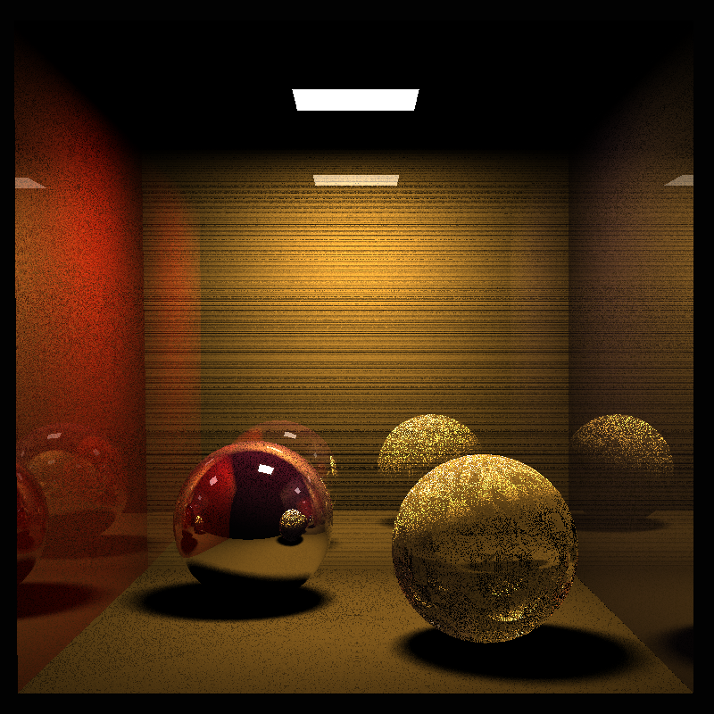

# PG1-raytracer
Raytracer project from the subject PG1 at CTU Prague 2024/25.

## Table of Contents
- [About](#about)
- [Features](#features)
- [Installation](#installation)
- [Usage](#usage)
- [Examples](#examples)
- [Possible extensions](#possible-extensions)

## About

**Author: Jakub Votrubec**  
**Subject teacher: Ing. Radek Richtr, Ph.D.**

This project is a raytracer developed as part of the PG1 course at CTU Prague for the academic year 2024/25. It demonstrates fundamental computer graphics concepts such as ray tracing, shading, and rendering. It also demonstrates the value of acceleration data structures when it comes to optimizing render time.

The full report in Czech can be found [here](report/report.pdf).

### Structure
- `build/` - created when compiling, holds the compiled `.o` object files
- `include/` - external header files
- `out/` - sample renders + progress of my implementation
- `report/` - report in Czech and LaTeX files I generated it from
- `res/` - sample scenes
- `src/` - structured source code
- `default_config.json` - default render configuration showcasing the config structure
- `Makefile` - build system using Make

### Dependencies
- [tinyobjloader](https://github.com/tinyobjloader/tinyobjloader) - for loading `.obj` files
- [nlohmann json](https://github.com/nlohmann/json) - for handling json configuration

## Features
- The raytracer takes in a configuration file and render the given scene into a `.ppm` image.

### Raytracing
- Basic ray tracing algorithm (for triangles).
- Shadow casting using a shadow ray from the point of intersection.
- Area lights by using random points on a triangle and sampling them (`samples_per_triangle` in the config file).
- Render types:
    - distance - based on the distance from the camera (aka depth),
    - diffusion - only taking the diffusion value of the material,
    - [Phong lighting model](https://en.wikipedia.org/wiki/Phong_reflection_model),
    - [Blinn-Phong lighting mode](https://en.wikipedia.org/wiki/Blinn%E2%80%93Phong_reflection_model).
- Shading types:
    - flat shading - triangle normal is used to compute the final color value,
    - smooth shading - uses the [Phong shading model](https://en.wikipedia.org/wiki/Phong_shading) to interpolate the normal of the intersection point from the normals of the vertices of the triangle hit (only works if the model has vertex normals).
- Fuzzysampling:
    - To counter the noise my renders have, I have implemented a sampling system configurable in the config file (`samples_per_pixel`).
    - For each pixel, the renderer casts multiple rays with slight direction changes and then averages the results.

### Accelerated data structures
- ADS abstract class prepared for extension into new accelerated data structures.
- Basic Octree implementation with configurable depth of the tree and triangle count per node.
- Parametric search Octree implementation. I implemented the algorithm from the research paper **An Efficient Parametric Algorithm for Octree Traversal** by J. Revelles, C. Urena, and M. Lastra.
    - Unfortunately, I wasn't able to make it work completely, but the implementation is still included.

## Installation
1. Clone the repository:
    ```bash
    git clone https://github.com/MasterVotr/PG1-raytracer.git
    ```
2. Navigate to the project directory:
    ```bash
    cd PG1-raytracer
    ```
3. Copy and create your own config file from the example one:
    ```bash
    cp default_config.json config.json
    ```
4. Build the project using Make:
    ```bash
    make compile
    ```

## Usage
1. Put your scenes in `.obj` and `.mtl` format in the `res/` directory.
2. Create your `config.json` with your scene configuration.
3. Run the raytracer with a sample config:
    ```bash
    ./raytracer config.json
    ```

## Examples
- Example images and scene files can be found in the `out/` and `res/` directories in `.ppm` format.
- I have converted some to `.png`:




## Possible extensions

### New ADS
- It is possible to implement your own acceleration data structure.
- Create it in the `ADS` directory.
- Extend the `Ads` abstract class.
- Override the `Build()` and `Search()` functions with your own implementation.
- Add this new implementation as an option to the `Renderer` class:
    - `ACCELERATION_DATA_STRUCTURE` enum - to represent the ADS,
    - `setup_config()` function - add the option,
    - `setup_ads` function - creation of the new ADS.

### Paralelization
- It would greatly speed up the rendering time if the rendering work divided among multiple threads.
- There is potential for CPU and GPU paralelization.
